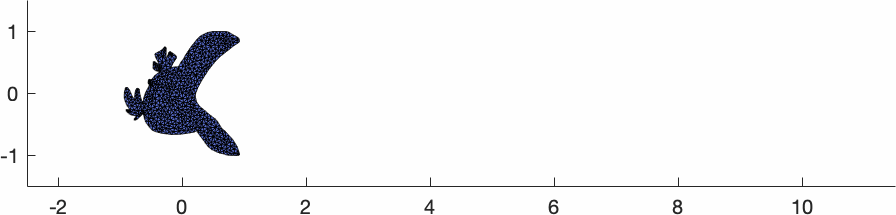

# Complementary Dynamics

Public Matlab code release for the SIGGRAPH Asia 2020 paper [Complementary Dynamics](https://www.dgp.toronto.edu/projects/complementary-dynamics/) by Jiayi Eris Zhang, Seungbae Bang, David I.W. Levin and Alec Jacobson.

# Dependency

[libigl](https://github.com/libigl)\
[gptoolbox](https://github.com/alecjacobson/gptoolbox)\
[Bartels](https://github.com/dilevin/Bartels)\
[triangle](https://github.com/libigl/triangle)

# Setup

Before running the code, you need to setup the following.\
Compile mex functions in Bartels:

    cd Bartles/matlab
    mkdir build
    cd build
    cmake ..
    make -j8

Compile mex functions in gptoolbox:

    cd gptoolbox/mex
    mkdir build
    cd build
    cmake ..
    make -j8

make sure `gptoolbox/wrappers/path_to_triangle.m` to indiciate your [tirangle](https://github.com/libigl/triangle) binary.

Compile mex functions in `matlab-include/mex` by running `matlab-include/mex/compileAllMex.m` in Matlab.

# Run

This code runs in Matlab.\
Before running examples, make sure to `addpath` your root directory of this project.\
Then, try run examples scripts in `examples` in Matlab.\
For example, try run `examples\bird\bird.m` and you should be getting result like this:

# Bibtex

    @article{Zhang:CompDynamics:2020,
      title = {Complementary Dynamics},
      author = {Jiayi Eris Zhang and Seungbae Bang and David I.W. Levin and Alec Jacobson},
      year = {2020},
      journal = {ACM Transactions on Graphics},
    }
